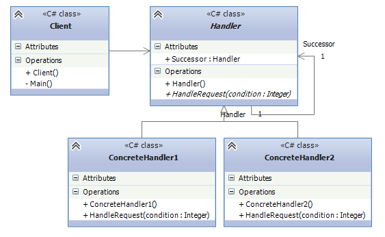

## Chain of responsibility
Gang of Four states:

`
Avoid coupling the sender of a request to its receiver by giving more than one receiver object a chance to handle the request. Chain the receiving objects and pass the request along until an object handles it
`
The pattern allows passing requests along a chain of handlers. Each receiver contains a reference to the next 
receiver.If one receiver cannot handle the request, it passes the same request to the next receiver, and so on.
In this case, one receiver can handle the request in the chain, or one or more receivers can handle the request.

## UML

From this scheme:
* Handler: defines an interface for request handling. Can contain a reference to the next request handler.
* ConcreteHandlers: implements the functionality of request handling. If the current handler can't handle 
the request but it contains a reference to the next handler, the next handler handles it.
* Client: sends request to `Handler` object.

The main drawback that the pattern has is the fact that the request might not be handled at all. If the chain
doesn't have necessary handler, then the request leaves the chain thus being unhandled.

## Example
Logging can be a great example for this pattern. If the user enables to print Information level logs, there
is no need to print message of Debug log level. From our example,
* `Logger` - Base Handler class, decides whether to pass the message to the next handler or not based on the
condition. If the Log level is set to the concrete handler's log level, current handler handles it, otherwise
the message is passed to the next handler.
* `DebugLogger`, `InfoLogger`, `ErrorLogger` - Concrete implementations of handler. Can be easily expandable.
For instance, if you wanted to add `WarningLogger`, you would implement Logger class' `Write` method, and set
it as the next logger for `InfoLogger`(for instance).

In our example, the chain looks like this:
DebugLogger => InfoLogger => ErrorLogger

## When should I use this pattern ?
when you can conceptualize your program as a chain made up of links, where each link can either handle
a request or pass it up the chain.