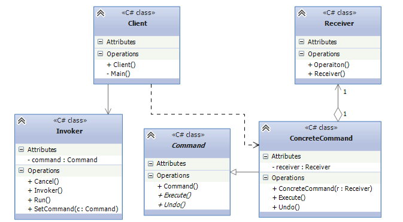

## Command pattern
Command Design Pattern is used to encapsulate a request as an object (i.e., a command) and pass it to an
invoker, wherein the invoker does not know how to serve the request, but uses the encapsulated command to
perform an action. Commands can be put in a queue and can also be undone. The example can be a simple `remote`.
You turn on the TV using the buttons(commands) of the remote. The remote doesn't know anything about TV, instead
it only knows how to invoke the specific command(e.g. TurnOnCommand). 

* Command: Defines an interface of command. Usually contains method `Execute()`, to perform command handling,
and sometimes `Undo()` method to cancel the command handling process.
* ConcreteCommand: Implements Command(by implementing `Execute` and `Undo` actions) and has a reference to 
the Receiver to call its operation.
* Receiver: Command handler. Defines a behaviour, that has to be done in result to a request.
* Invoker: Command initiator - calls the command for specific request handling.
* Client: Creates the command through `SetCommand` method.

## When should i use the pattern ?
1. When you need to parameterize objects with an action to perform, the Command pattern can encapsulate the action as an object, enabling the dynamic assignment and execution of actions.
2. If you want to decouple the object that initiates a request (sender) from the objects that perform the request (receivers).

## Example
Ordering in a restaurant is a good example to understand the pattern. When client orders something to waiter,
waiter doesn't know the preparation process of the dish, he/she only knows that it has to be sent to the Chef.
So, from our example:
* ICommand - base command. Defines 2 methods: Execute() and Undo(), and 1 property: The name of the food.
* PizzaOrderCommand, FriesOrderCommand - concrete commands. The commands direct the order to the chef using
the specific food-related method(e.g. PreparePizza).
* Chef - Receiver. Receives these commands and prepare the necessary foods.
* Waiter - Invoker. Can take the orders and place them(which means directing them to chef). In this way,
the waiter knows how to take the orders, place them and cancel them. And the internal implementation of 
preparation process is hid from the client, which makes the pattern flexible.