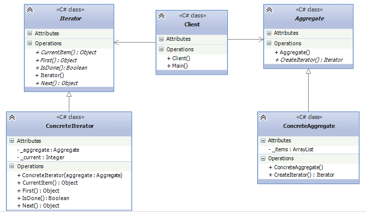

## Iterator
The Iterator Design Pattern allows sequential access to the elements of an aggregate object
(i.e., collection) without exposing its underlying representation. 

## When should we use iterators ?
* When it is necessary to traverse the object without exposing its internal structure.
* When you have a number of composite objects, and need to provide a common interface for their traversal.
* When it is necessary to provide some alternative options to traverse the same object.

## Understand UML
* Iterator: defines an interface to traverse composite objects.
* Aggregate: defines an interface to create object-iterator
* ConcreteIterator: a concrete implementation of Iterator to traverse Aggregate object. 
* ConcreteAggregate: a concrete implementation of Aggregate. Stores elements that we need to traverse.
* Client(Main): uses Aggregate and iterator.

## Example
* `IStudentIterator` - Iterator
* `IStudentEnumerable` - Aggregate
* `CourseNumerator` - ConcreteIterator
* `Course` - ConcreteAggregate
* `University` - Client

## Why do we need all this ?
The key point is `encapsulation` and `expandability`. If we wanted to have multiple courses and we could make University
as a `ICourseEnumerable` implementation, and define our custom iterator and aggregate through adding
`ICourseIterator` and `ICourseEnumerable`. 