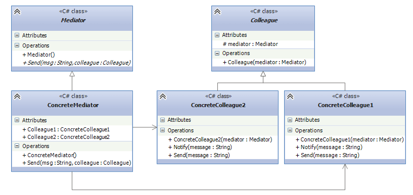

## Mediator
Mediator pattern allows loose coupling by encapsulating the way disparate sets of objects interact and
communicate with each other. Allows for the actions of each object set to vary independently of one another.
The Mediator Design Pattern reduces the communication complexity between multiple objects.If the objects
interact with each other directly, the system components are tightly-coupled with each other that makes
higher maintainability cost and not hard to extend. Mediator pattern focuses on providing a mediator between
objects for communication and help in implementing loose-coupling between objects.

* Mediator: defines an interface for interaction with Colleague objects.
* Colleague: defines an interface for interaction with Mediator.
* ConcreteColleague1, ConcreteColleague2: concrete colleagues that exchange message with each other through
the Mediator object.
* ConcreteMediator: concrete implementation of Mediator.

## When should you use this pattern ?
1. When you have a set of interlinked objects, which have complicated references to each other
2. Use a mediator when the complexity of object communication begins to hinder object reusability. 

## Example
The group chats in any application is an example of Mediator pattern. From my example,
* ChatRoom is an implementation of IMediator. This allows us to add more of grouped rooms in the future.
* User, AdminUser are the implementations of Client. This allows to add clients or
users with different privileges of any kind in the future.

