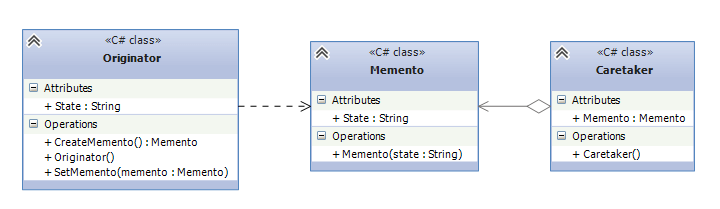

## Memento
The Memento Design Pattern is a Behavioral Design Pattern that can restore an object to its previous state.
The pattern is useful in scenarios when you need to restore some state or when you want to rollback to some
action. Think of it as of transactions in the databases. You can add savepoints in the transaction add rollback
to this savepoint when necessary.

* Originator - creates a memento object containing a snapshot of the Originator’s current state. Restores
the Originator to one of its previous states.
* Memento - holds information about the Originator’s saved state. 
* Caretaker - stores the Memento object for later use. Never modifies or checks the contents of the Memento 
object. The Caretaker is the class that calls the Save() and Restore() methods on Originator.

## When should i use Memento ?
* When it is needed to store the object's state so that we could rollback to it eventually.
* In scenarios where you want to capture an object’s state without exposing its implementation details.

## Example
Database Transactions is used as an example to this pattern.
* Transaction - Originator. Whenever a SavePoint method is called in the transaction, the new TransactionMemento(wrapper around an operation in db)
is created and points to the current operation.
* TransactionMemento - Memento. Serves as the operation to which transaction can rollback to. 
* TransactionManager - Caretaker. Allows to set savepoints and rollback to the last savepoint set on the transaction.
