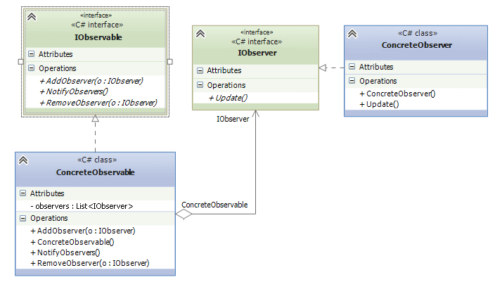

## Observer
The design pattern `Observer` defines a one-to-many dependency between objects so that when one object changes
state, all its dependents are notified and updated automatically. This pattern fits perfect in the projects that
have a resource to which clients refer to, and this resource has to notify the clients whenever a new update is 
made on a resource. 

Here, `IObserver` defines a single client that must get notified(we will call Update method to notify the 
observer). `IObservable` defines a centralized resource that clients will use. `ConcreteObservable` is an
implementation of this resource, and `ConcreteObserver` is a type of the observer

## Sample
A good example for this pattern would be `Webhook`. Imagine you have an API that sends webhook updates to users
based on their roles. Users with `admin` rights would receive full information on how all users in the system
used the update, and the user with no privileges would receive information related to himself only.
In that case, 
* `IObserver` would have `ConcreteObservers` like `AdminUser` and `User`.
* `Observable` service would an API itself. In this case, `NotifyObservers` method would just call Update method
of `IObserver` interface without even knowing the different user's priveleges.

## Example
In our case, `ProductStock` is the `IObservable` resource. Observers, e.g. Users, have their product preferences
as a property `DesiredProductName`, and they would get notified whenever a new product is added to product stock and the product
must be available too.

