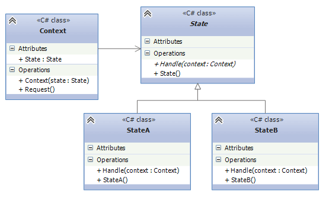

## State
State Design Pattern allows an object to alter its behavior when its internal state changes.This pattern is
useful when an object needs to go through several states, and its behavior differs for each state. Instead of
having conditional statements throughout a class to handle state-specific behaviors, the State Design
Pattern delegates this responsibility to individual state classes.

1. `State`: This is going to be an interface(abstract class) that is used by the Context object.
This interface defines the behaviors that the child classes will implement in their own way.
2. `StateA, StateB`: These will be concrete classes that implement the State interface and provide
the functionality the Context object will use. Each concrete state class provides behavior of the single State.
3. `Context`: This class will hold a concrete state object that provides the behavior according to its current
state. This class is going to be used by the client.

## When should we use the pattern ?
* When the behaviour of the object must change when its state changes and may change dynamically at runtime.
* When object's method contains a lot of conditional constructions, and the choice depends on the current state
of the object.

## Understand in example
Imagine a package delivery service. Packages have a number of steps(e.g. Ordered, Shipped, Delivered).
* `PackageState`: defines an abstract class for all states.
* `OrderedState`: The case when package is at ordered state. 
* `PackageContext`: Serves as a class which **encapsulates** the package's state changing process.
