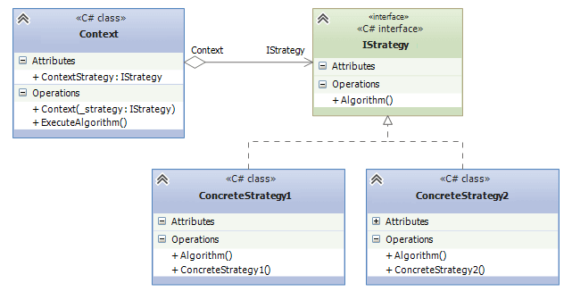

## Strategy
Strategy Design Pattern define a family of algorithms, encapsulate each one, and make them interchangeable.
Strategy lets the algorithm vary independently from clients that use it.

From this image, `IStrategy` is the base class(interface) for algorithms. ConcreteStrategies are different algorithms
that client plans to use. `Context` is the class that allows the client to choose which algorithm to use.
## Example
In our example, the client is given three transport types that he can use. Think of them as of algorithms. 
`IMovable` is the interface that each transport type must implement. In `TransportContext`, we allow the client
to pass the implementation type `dynamically`, as the transports define a single method called `Move()`.

## When to use this pattern ?
* When you need to dynamically change the behavior of an object based on some context or state.
* If you have several different algorithms or behaviors for a specific task, and you want to encapsulate each one in its own class.
The Strategy pattern allows you to switch between these algorithms without changing the clients that use them.