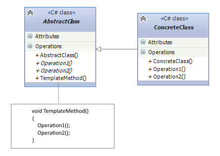

## Template
Template Method Design Pattern defines a sequence of steps of an algorithm and allows the subclasses to override
the steps but is not allowed to change the sequence.

## When should i use the pattern ?
* When assumed, that subclasses have to override the steps of the algorithm without changing the structure
* When there’s a common workflow or series of steps in an algorithm, but some of the steps may vary in their implementation across different contexts or classes.

## Example
In our example, the abstract(template) class is `Converter`. All document converters follow the same converting
algorithm(e.g. opening file, creating file of specific extension, and writing the content to newly created file).
So base class define these steps, and their concrete implementations: `PdfConverter` and `DocConverter` convert
the file to their respective extensions. 

