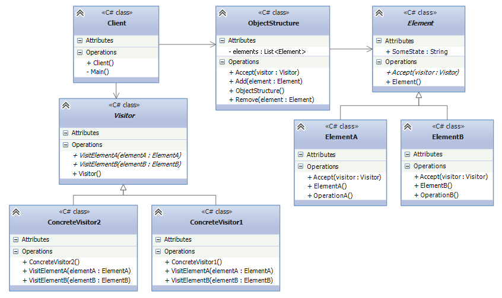

## Visitor
The Visitor design pattern allows you to add further operations to objects without modifying them.
When using Visitor design pattern two hierarchy of classes are defined: first is for elements, to which we
have to define new operations, and second is for visitors, who declares these operations. 

* Visitor - base visitor class, that has `Visit()` method for each Element
* Element - contains method `Accept()`, in which Visitor is passed as a parameter.
* ConcreteVisitor1/ConcreteVisitor2 - concrete visitor implementations.
* ElementA / ElementB - concrete elements that implement `Accept()` method.
* ObjectStructure - stores Element objects and provides access to them. 

## When to use ?
* When you have a number of different classes(with different interfaces), and want to do different operations
with each of these objects.
* When it is needed to create new operations on a set of objects without changing the object structure or classes.
* When new operations are added frequently to the classes, but the general structure of the classes doesn't change.

## Example
Finding areas, perimeters of the objects with different shapes can be an example for Visitor design pattern.
* AreaVisitor, PerimeterVisitor - ConcreteVisitors. They encapsulate operations that can be applied in elements.
* Circle, Rectangle - ConcreteElements. They represent the object structure and delegate operations to the visitor.
* Elements - ObjectStructure. Allows to perform different operations on elements. 

This structure makes it easy to add new operations on elements(shapes). Add new operations through implementing
`IVisitor` without modifying the element classes. The element classes focus on their data, while visitors focus on behaviors or operations.