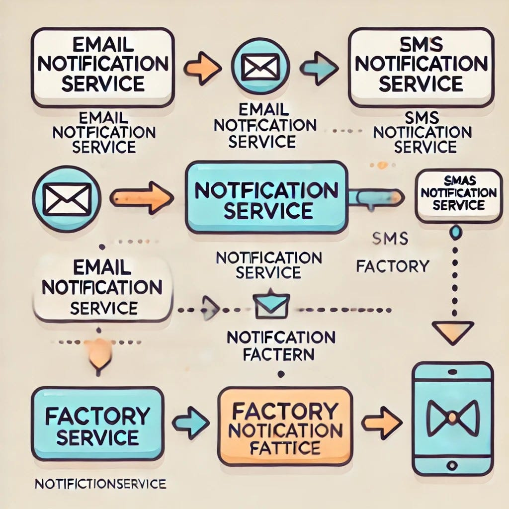

## Definition
The Abstract Factory Design Pattern provides a way to encapsulate a group of factories with a common theme without specifying their concrete classes.
Abstract Factory Pattern is a software design pattern that provides a way to encapsulate a group of individual factories that have a common theme.

## Abstract Factory method pattern
Abstract Factory patterns define this behaviour:
* You have a service(call `NotificationFactory`) which is responsible for sending notifications of certain type(e.g. sms, email, or push
notifications).
* All notifications share the same functionality, so a single interface called `INotification` and containing a single
method called `Send` is enough.
* To create a notification of certain type we have to define another factories that inherit the functionality of 
the base NotificationFactory and is responsible for creating a notification of the needed type.

Consider the image below:



This approach provides expandability, as if we were to add new service called `PushNotificationService`, everything
we would need to do is:
1) To create a `PushNotification` class
2) Define a `PushNotificationService` which would call to the `PushNotification` API.

### Drawback
This pattern is good, but not perfect, as creating new service obligates us to create 2 classes. As a solution,
I think centralized `NotificationFactory` class seems like a better approach. In this way, we would need to 
create a single class for new API. For example:
```csharp
public abstract class NotificationFactory
{
    public virtual INotification CreateNotification(string type)
    {
        switch (type)
        {
            case "email":
                return new EmailNotification();
            case "sms":
                return new SmsNotification();
        }
    }
}
```
In this way, no extra factories are needed. But this way, is an example of simple `factory` pattern, so it's not suitable 
for us.

### What should I keep in mind
The Abstract Factory Design Pattern consists of the following components:

* `AbstractFactory`: Declares an interface for operations that create abstract products. This will be an interface for operations that will create Abstract Product objects.
* `ConcreteFactory`: Implements the operations to create concrete product objects. These classes implement the Abstract Factory interface and provide implementations for the interface methods. We can use these concrete classes to create concrete product objects.
* `AbstractProduct`: Declares an interface for a type of product object. These are going to be interfaces for creating abstract products. Here, we need to define the Operations a Product should have.
* `ConcreteProduct`: Implements the AbstractProduct interface. These are the classes that implement the Abstract Product interface.
* `Client`: Uses interfaces declared by AbstractFactory and AbstractProduct classes. This class will use our Abstract Factory and Abstract Product interfaces to create a family of products.