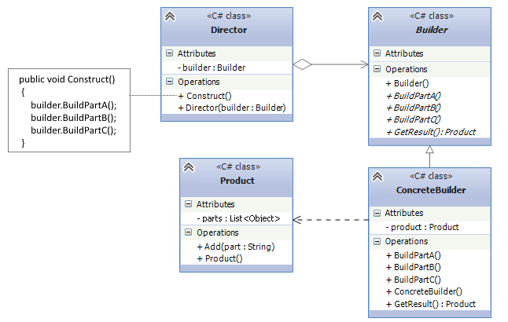

## Builder pattern
Builder Design Pattern builds a complex object using many simple objects and a step-by-step approach.
The Builder Design Pattern is about separating the construction process of a complex object from its representation, allowing the same construction process to create different representations.
## Director, builder, product
`Builder` pattern must have three classes that would help us create different products. 
1) `Product` is a class that defines different parts that will make that product
2) `AbstractBuilder` defines different steps to make the concrete product
3) `ConcreteBuilder` implements(inherits) AbstractBuilder and provides implementation to all the abstract methods.
Is responsible for constructing individual parts of the product.
4) `Director` defines the sequences of steps to build the product in one whole.
## When should we use this pattern ?
* When the process of creation of new object mustn't depend on which details does it consist of and how are they
related to each other

## UML
