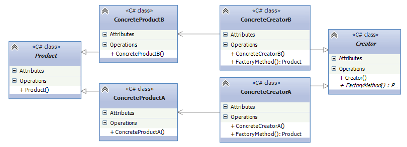

## Definition
```
Define an interface for creating an object, but let subclasses decide which class to instantiate
```
In the `Factory` Design pattern, we create an object without exposing the Object Creation and Initialization
logic to the client, and the client will refer to the newly created object using a common interface.
The basic principle behind the Factory Design Pattern is that, at run time, we get an object of a similar type
based on the parameter we pass. So, the client will get the appropriate object and consume the object without
knowing how the object is created and initialized.

## UML Diagram


## Factory vs AbstractFactory
Factory method pattern is simpler than Abstract Factory patter, because we don't need to create a family of 
factories if we want to encapsulate some product's creation.
In our example, we can see that Notification service doesn't need to have the other factory classes that would
instantiate specific notification type. The creation of `EmailNotificationFactory` doesn't make sense, as email
notification is the only class it would need to create. Thus the creation of `EmailNotification` can be
encapsulated inside of the NotificationFactory class.

