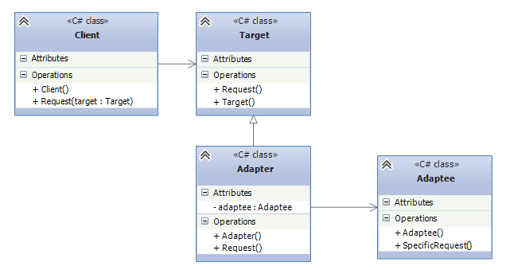

## Adapter 
The Adapter Design Pattern is a structural pattern that allows objects with incompatible interfaces to work together.
It acts as a bridge between two incompatible interfaces. This pattern is useful when you want to use existing classes,
but their interfaces do not match the one you need.

* Target - defines objects that are used by the client.
* Client - uses Target objects to implement its tasks.
* Adaptee - defines an adaptable class, that we would want to use in client instead of Target objects.
* Adapter - adapter(bridge), that allows to work with Adaptee objects like its working with Target objects.

## When to use ?
* If you have existing classes with functionality that you need to use, but their interfaces don’t match the ones your system currently uses, an adapter can bridge this gap.
* When you have several classes with different interfaces but want to treat them uniformly through a common interface.

## Example
Consider a scenario when you are working with different types of printers. Each printer has its own API for
printing documents, but you want your application to work with all printers through a common interface.
* IPrinter - Target. This is a common interface your application will use to interact with printers.
* LaserPrinter, ThermalPrinter - Adaptee. 
* LaserPrinterAdapter, ThermalPrinterAdapter - Adapters. A wrapper for each printer type to conform to the IPrinter interface.
* PrinterClient(Client) - the application that interacts with printers through the `IPrinter` interface.

IPrinter allows the client code to remain consistent across different printer types. So adding new type of
printer only requires creating a new adapter, leaving the client code unchanged.