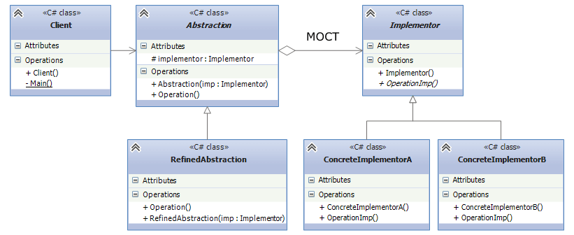

## Bridge
Bridge is a structural design pattern that lets you split a large class or a set of closely related
classes into two separate hierarchies—abstraction and implementation—which can be developed independently
of each other.

* Abstraction - a definition of a base interface and has a reference to Implementor. An execution of 
an operation in Abstraction is delegate to Implementor objects.
* Implementor - defines a base interface for concrete implementations. 
* RefinedAbstraction - inherits from Abstraction and extends the base interface.
* ConcreteImplementorA/ConcreteImplementorB - concrete implementations of Implementor.
* Client - uses Abstraction objects.

## Example
Sending messages of different types through different platforms can be an example for the pattern.
Email messages need to be send through EmailService, whereas text messages can be sent through different 
platforms like Sms, Whatsapp. From our example,
* Message - Abstraction. This is a base class for message types, and implementors can write their
custom code logic.
* IMessageSender - Implementor. This class serves as a `platform` for messages.
* TextMessage/EmailMessage - RefinedAbstraction.
* WhatsApp/EmailService - ConcreteImplementors. Different platforms contain a different logic for message sending.

With this pattern, the implementation is separated from the base class. We can extend independently the
two hierarchy of classes. At the runtime, we could change the concrete implementation without modifying
the existing code.

## When should i use the pattern ?
* If your application needs to switch between different implementations at runtime.
The Bridge pattern allows you to change the implementation dynamically without altering the abstraction.
* When you need to avoid the dependency between the abstraction and the implementor. 

