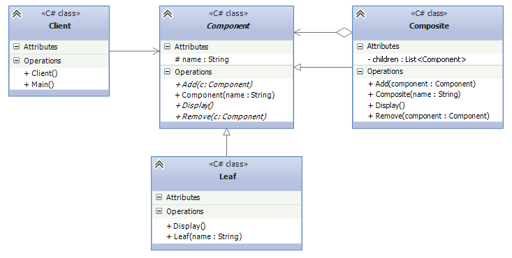

## Composite
Compose objects into tree structures to represent part-whole hierarchies. Composite lets clients treat
individual objects and compositions of objects uniformly. This is especially useful when working with
hierarchical structures like file systems, UI components, or organizational structures.

* Component - defines an interface for all components in tree structure.
* Composite - defines a component that can have another components and implement the mechanism of adding/removing.
* Leaf - represents another component that **can't** have another components.

## When should I use this pattern ?
* When objects need to be implemented in tree structures.
* If you want to treat both individual objects and their compositions in the same way.
This is useful when you want to ignore the difference between compositions of objects and
individual objects.

## Example
"Files in the folders" is the basic(and the only one i found lol) example for the pattern.
Folders are the files and may contain another folders or files in itself. From the example,
* Component - BaseComponent. The files and folders implement this class to define its behaviour.
* File - Leaf. Serves as a leaf because we can't place another files inside the file, because it's not a folder.
The call of Add/Remove methods won't print anything as these methods aren't implemented the class.
* Folder - Composite. Can contain files/folders. Add/Remove methods are implemented in the class, because
the class is made for this behaviour.

