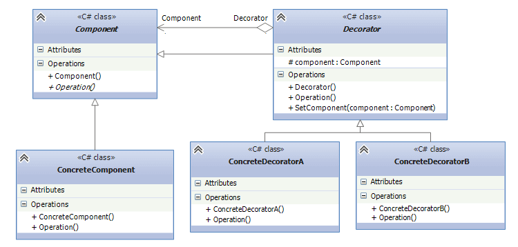

## Decorator
The Decorator Design Pattern in C# allows us to dynamically add new functionalities to an existing object
without altering or modifying its structure, and this design pattern acts as a wrapper to the existing class.
Think of extension methods to classes in C#. Strings don't allow inheritance but due to the extension methods
we can add custom methods to the class without even altering the string class' structure.

Inheritance is mostly used to define new functionality. Decorators, on the other hand, allow to add new 
functionality at the `runtime`.

* Component - base class, that define an interface to the implementers.
* Decorator - abstract class, that implements Component interface and contains a reference to a component instance.
* ConcreteComponent - component implementer, to which a new functionality is added via a decorator.
* ConcreteDecoratorA / ConcreteDecoratorB - provide an additional functionality that `ConcreteComponent`
must be extended by.

## Example
Let's take a look at Logger example. Loggers can be with different providers: ConsoleLogger, DebugLogger,
and each logger may be decorated with Timestamp or other custom properties embedded to the messages.
* ILogger - Component. Defines a single Log() method to the implementers.
* ConsoleLogger - ConcreteComponent. Means that we will print the messages to the console.
* LoggerDecorator - Base decorator. Has a reference to the ILogger(component) because we might want to decorate
other logger providers too.
* TimestampLogger - ConcreteDecorator. Decorates the current log provider with the time stamp in the beginning.

With this implementation, we can make decision, that this pattern is flexible. Adding `DebugLogger` wouldn't 
affect the code implementation.

## When should i use this pattern ?
The Decorator Pattern is used for adding additional functionality to an existing object
(i.e. already instantiated class at runtime), as opposed to object's class and/or subclass.
So it should be used when you need to dynamically add new functionalities to the objects.

