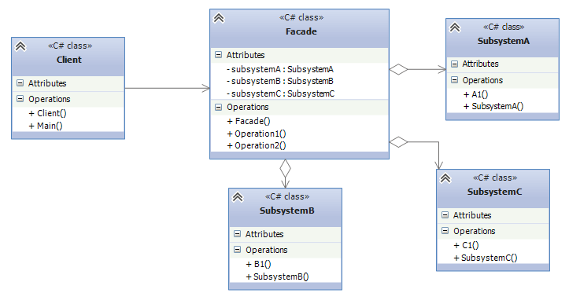

## Facade
Facade design pattern is used when you need to provide a unified interface to a set of interfaces
in a subsystem. The Facade Design Pattern defines a higher-level interface that makes the subsystem
easier to use.

* The Facade Class: knows which subsystem classes are responsible for a given request,
and then it delegates the client requests to appropriate subsystem objects.
* The Subsystem Classes: implement their respective functionalities assigned to them,
and these classes don't know the Facade class.
* Client: uses the Facade class to access the subsystems.

## When should the pattern be used ?
* When you have a complex system, and need to simplify the interaction with it.
* When you need to minimize the number of dependencies between th client and a complex system. Facade
objects allow to isolate components of the system from the client and work with them independently.

## Example
SQL operations encapsulate the internal implementation(e.g. opening and closing database connections) of 
the database operations. And optionally, every query in db can be wrapped around transactions. From
our example,
* DbConnection - Subsystem A. Allows storing connection strings in connections pool and open/close the 
connections.
* DbQueryExecutor - Subsystem B. Allows executing operations, but doesn't open/close connections as it is
not his responsibility.
* Transaction - Subsystem C. Allows wrapping operations around transaction.
* DbQuery - Facade. This is where all operations are executed simultaneously.

This approach, is recommended, but the client can use each subsystem separately, but using the facade is
preferable as the client might not follow the right order to execute the db query.