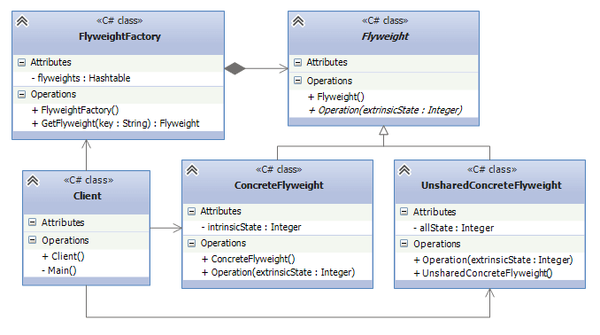

## Flyweight
The flyweight pattern is useful when dealing with a large number of objects that share simple 
repeated elements which would use a large amount of memory if they were individually embedded.
It is common to hold shared data in external data structures and pass it to the objects temporarily when
they are used. 

That means the Flyweight Design Pattern is used when there is a need to create many objects of
almost similar nature. A large number of objects means it consumes a large amount of memory, and the
Flyweight Design Pattern provides a solution for reducing the load on memory by sharing objects.

## Dividing the pattern
Flyweight pattern has 2 states: Intrinsic and Extrinsic. 
* `Intrinsic` is a state in which constants are stored in memory(cache). 
* `Extrinsic` is a state when a constant needs to change its appearance. 

## UML diagram

* Flyweight - defines an interface, through which shareable objects can get extrinsic state or affect to it.
* ConcreteFlyweight - a concrete class of the shareable flyweight. Implements Flyweight methods and if needed,
adds an intrinsic state. 
* UnsharedConcreteFlyweight - another implementation of Flyweight, but this time the objects of the class
are unsharable.
* FlyweightFactory - creates a flyweight objects. This class exists, because the client shouldn't know
which flyweight object is being created. From the image above, to store the flyweights we use 
Dictionary(Hashtable).
* Client - uses flyweight objects. Can store the extrinsic state and pass it as an argument to flyweight
methods.

## Example
Rendering different locations icon and showing them in the map can indeed be an example of the pattern.
Intrinsic state will be the icons(photos) of the locations that the user is looking for. Extrinsic
State will be the latitude and longitude coordinates as they are unique for each location. From our example,
* ILocationMarker - Flyweight. 
* RestaurantMarker, HospitalMarker - ConcreteFlyWeights. Have the intrinsic state of the icons.
* LocationMarkerFactory - FlyweightFactory. Caches the instances of the `Markers` and returns them to the
client.

So this pattern ensures that only one instance of each marker type is created and reused, reducing memory
usage. 

## When should you use this pattern ?
1. When your application needs to manage a large number of similar objects, keeping an instance of each
object is resource-intensive.
2.  In situations where objects can have shared states (intrinsic state) that can be factored out and
shared among multiple objects. 
